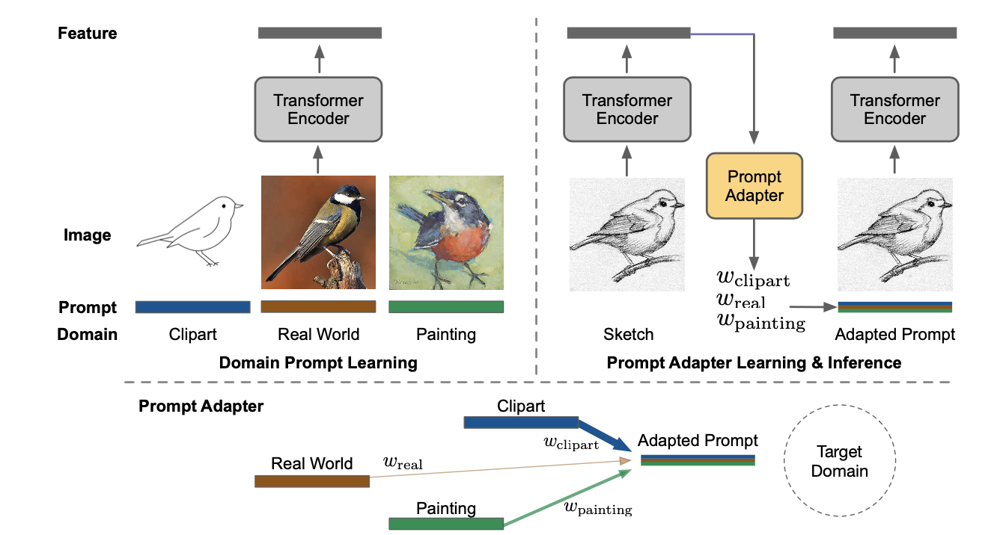

# Prompt Vision Transformer for Domain Generalization (DoPrompt)

Pytorch implementation of **DoPrompt** (Prompt Vision Transformer for Domain Generalization)

## Overview

Architecture of Network:



## Training

Refer to [DomainBed Readme](README_domainbed.md) for more details on commands running jobs. The training setting sweeps across multiple hyperparameters. Here we select some hyperparameters that can reach a good result.

```sh
# OfficeHome
python -m domainbed.scripts.train --data_dir=./domainbed/data/ --steps 5001 --dataset OfficeHome --test_env 0/1/2/3 --algorithm DoPrompt --output_dir results/exp \
     --hparams '{"lr": 1e-5, "lr_classifier": 1e-3}'
# PACS
python -m domainbed.scripts.train --data_dir=./domainbed/data/ --steps 5001 --dataset PACS --test_env 0/2/3 --algorithm DoPrompt --output_dir results/exp \
     --hparams '{"lr": 5e-6, "lr_classifier": 5e-4}'
# VLCS
python -m domainbed.scripts.train --data_dir=./domainbed/data/ --steps 5001 --dataset VLCS --test_env 0/1/2/3 --algorithm DoPrompt --output_dir results/exp \
     --hparams '{"lr": 5e-6, "lr_classifier": 5e-6}'
```

## Collect Results

```sh
python -m domainbed.scripts.collect_results --input_dir=results
```

## Requirements

```sh
pip install -r requirements.txt
```

## Citation

TBD

## Acknowlegdement

This code is built on [DomainBed](https://github.com/facebookresearch/DomainBed). We thank the authors for sharing their codes.
